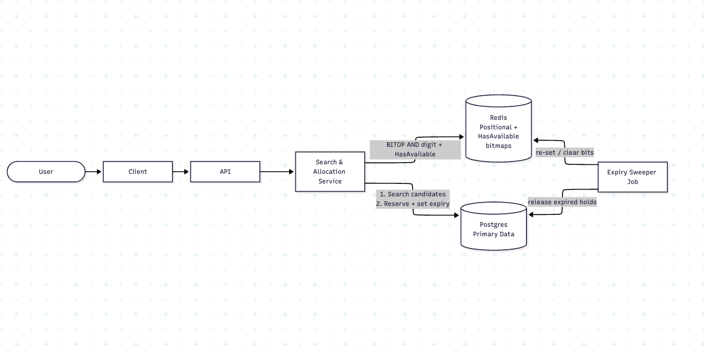
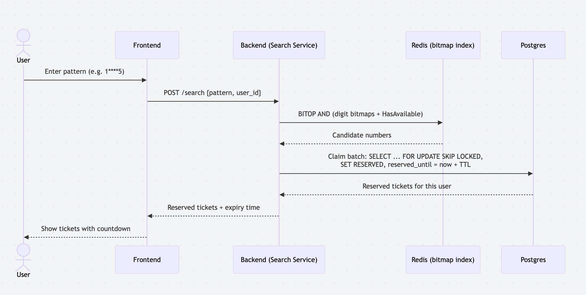

# Lottery Search System

Ticket has only 1M distinct number, and we can roughly average 10 ticket per each when we have 10M records
This make `Bitmap Indexing` perfect suite for the data because ticket number is main searching hit point, it is number and it has many duplicate

## Database Choice
I choose PostgresDB

### Reason
1. Support Atomic claim and Concurrent with query of SELECT … FOR UPDATE SKIP LOCKED LIMIT N, so update status and its expiry_time and be in one statement
2. Partial indexes
3. Can be scale by partitioning, or Citus for sharding and also replica reading for huge amount of data

## System Design

### Component
1. Client: Frontend Service for user interface
2. Backend: Search and Allocation Service (holds the positional bitmaps in memory)
3. PostgreSQL: PostgresDB and Redis
4. Background Worker: Where cron, schedule process located to reconcile correctness of data

### Control Flow

#### Search and Reserve
1. Client enters a wildcard pattern. `Frontend` calls POST /search with `pattern` and `user_id`
2. Backend validates the pattern (`[0-9*]{6}`).
3. Backend bitwise ANDs the bitmaps of the fixed digits, then ANDs the `HasAvailable` bitmap, to get candidate numbers that both match the pattern and are known to still have stock.
4. Backend runs ONE atomic claim in database on available tickets with those numbers, then sets data of `reserved`, `reserved_by`, `reserved_until`.
5. Backend returns only the tickets this user now holds.
6. User confirms before expiry: `reserved` becomes `sold`, requiring `reserved_by = user` and `reserved_until` is not expired.
7. If the user does not confirm, the Background Worker releases the hold after `reserved_until`.
8. This will allow service to work concurrency in database level

## Wildcard Search: Algorithm and Indexing

### 1. Candidate Matching (Positional Bitmap Index)

There are 1M possibel lottery ticket numbers (000000–999999). For each of the
6 positions and each of the 10 digits, we build one bitmap over those numbers,
giving 6 × 10 = 60 bitmaps. They are stored in memory as
`Bitmap[position][digit]` (positions are 0-indexed, left to right).

Bit `n` of `Bitmap[p][d]` is 1 if number `n` has digit `d` at position `p`.

To search a pattern, AND the bitmaps of its fixed digits. Wildcards (`*`)
are skipped. The result is a bitmap of all matching numbers.

Example: 
`1****5` => `Bitmap[0][1]` AND `Bitmap[5][5]`
`****23` => `Bitmap[4][2]` AND `Bitmap[5][3]`

These Bitmaps will store in memory, such as Redis or Instance Memory
The result is a bitmap of matching numbers with at most 10^k members, where k is the number of wildcards. 
For example, 1****5 yields at most 10^4 = 10,000 numbers, and Only ****** reaches 10^6

### 2. Availability Pre-Filter (`HasAvailable` Bitmap)
From 1. we can only tell which number match the search pattern. We can enhance or reduce search sample by add one more bit for query only available number in stock

HasAvailable — bit n is 1 if number n currently has at least one available ticket.
It is ANDed into the pattern result before we touch the database:

`candidates = Bitmap[p1][d1] AND … AND Bitmap[pk][dk] AND HasAvailable`

This relies on The Expiry Sweeper to maintain HasAvailable: clear a number's bit when its last ticket leaves available, and set it again when stock returns (e.g. a reservation expires). The positional bitmaps are static and never change.

### 3. Database Indexing (Availability Lookup)
We now able to list candidates of tickets both available and non-avaliable(if needed).
To make database query efficience we must index stored data assume that table look like this

Table: Ticket

| Name               | DataType                                 |
| ------------------ | -----------------------------------------|
| `ticket_id`        | string (uuid)(pk)                        | 
| `ticket_number`    | integer                                   |
| `ticket_status`    | string (enum (available/reserved/sold))  |
| `reserved_by`      | string (uuid)(fk->user)                  |
| `vendor_by`        | string (uuid)(fk->vendor)                |
| `reserved_until`   | datetime                                 |
| `created_at`       | datetime                                 |
| `updated_at`       | datetime                                 |

1. Create index of ticket_number prefix
2. Create indexer of ticket_number where status = "available"
3. Create index of ticket_number prefix" plus the LIKE reference

PostgreSQL builds B-tree indexes by default. A B-tree keeps keys in sorted
order, so it can find one value or scan a contiguous range in O(log n) page
reads, and it stays balanced as rows are inserted and updated

[reference](https://naveenkumar-c.medium.com/indexing-on-prefix-searches-using-like-in-postgresql-277f034a87a7)

Because the partial index only contains available tickets, numbers with no tickets left never appear in it, so the claim query skips them automatically

### 4 Performance Analysis

1. Memory usage, the number space is fixed at 1M, so every bitmap is a dense 1,000,000-bit vector.

| Structure | Bitmaps | Bits each | Size each | Total |
|-----------|---------|-----------|-----------|-------|
| Positional `Bitmap[position][digit]` | 6 × 10 = 60 | 1,000,000 | ~125 KB | **~7.5 MB** |
| `HasAvailable` | 1 | 1,000,000 | ~125 KB | **~125 KB** |

Total memory allocation around 7.6 MB — small enough to hold in process memory on every instance.

2. Search / Candidate Matching Cost

A search ANDs the bitmaps of the fixed digits plus `HasAvailable`. The number of
AND operations equals the count of fixed digits (`6 − k`, where `k` =
wildcards), each over a 125 KB vector.

| Pattern | Wildcards `k` | AND ops | Max candidates (`10^k`) |
|---------|---------------|---------|--------------------------|
| `123456` | 0 | 6 + 1 | 1 |
| `123***` | 3 | 3 + 1 | 1,000 |
| `1****5` | 4 | 2 + 1 | 10,000 |
| `****23` | 4 | 2 + 1 | 10,000 |
| `******` | 6 | 0 + 1 | 1,000,000 |

# APPENDIX
## Architecture

## Sequence Diagram
